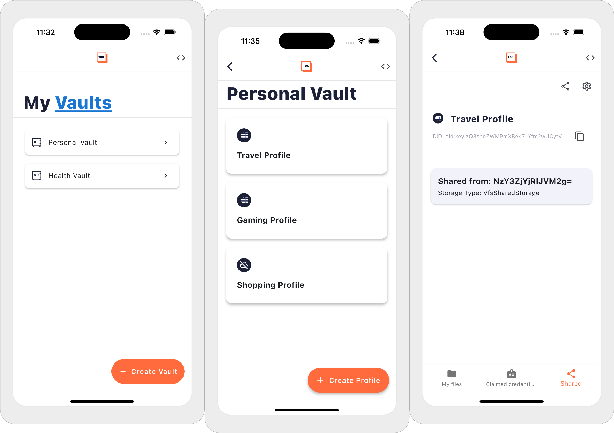

# Affinidi TDK - Vault Reference App

This reference application demonstrates the sample usage of the [Affinidi TDK - Vault](https://pub.dev/packages/affinidi_tdk_vault) package and guides you through integrating it into your Flutter projects to create a decentralised digital identity wallet.

It's the implementation of the Self-Sovereign Identity (SSI) concept to create digital identities with Decentralised Identities (DID), manage associated cryptographic keys, and provide a secure storage layer to store credentials and personal files, whether on the cloud or the device's local storage.

> **IMPORTANT:** 
> This project does not collect or process any personal data. However, when used as part of a broader system or application that handles personally identifiable information (PII), users are responsible for ensuring that any such use complies with applicable privacy laws and data protection obligations.

## Core Concepts

- **Decentralised Identifier (DID):** A globally unique identifier that enables secure interactions. The DID is the cornerstone of Self-Sovereign Identity (SSI), a concept that aims to put individuals or entities in control of their digital identities. DID has different methods to prove control of digital identity.

- **Verifiable Credential (VC):** A digital representation of a claim created by the issuer about the subject (e.g., Individual). VC is cryptographically signed and verifiable.

- **Vault:** A vault is a secure digital wallet that allows you to manage your digital identities, personal documents, and store credentials securely, such as verified identity VC and certificates. It protects the data stored in the vault with end-to-end encryption.

- **Profile:** A profile represents your digital identity based on context (e.g., Work, Banking, Shopping). It allows you to manage credentials and personal files related to your profile, including sharing your profile with other users. Each profile has its own Decentralised Identifier (DID).

## Preview

The reference app guides you through the implementation of the Affinidi TDK - Vault in your Flutter applications, including the best practices. It showcases vault creation, multi-profile management, and profile sharing.



## Key Features

The reference app implements the following key features of Affinidi TDK - Vault to manage digital identities, verifiable credentials, and data sharing.

- **Vault + Multi-profile** - create a personal vault to create multiple profiles representing your digital identities based on context. For example, you can have a profile for personal banking or work.

- **Secure Storage** - choose between cloud storage or use your device's local storage to securely store your credentials and personal files related to your identity.

- **Profile Sharing** - share your profile with other users, delegating them access to your credentials and personal files. You can provide read-only or write access to your profile and revoke it later.

- **Manage Files and Folders** - upload documents related to your identity into your profiles and share them with other users.

- **Claim Credentials** - claim Verifiable Credentials (VCs) and store them in your vault's profile. The claim credential flow follows the OID4VCI standard.

The reference application provides in-app documentation and code snippets to help you quickly onboard into Affinidi TDK - Vault to implement on your Flutter application.

Refer to [the documentation](https://docs.affinidi.com/dev-tools/affinidi-tdk/dart/libraries/vault/) to learn more about Affinidi TDK - Vault available methods and features.

## Requirements

- Flutter version 3.27.0
- Dart SDK ^3.5.4

## Getting started

Set up your local environment to run the vault application.

### Running the Application

Run the application using standard Flutter commands:

```bash
flutter run
```

To run on a specific device:

```bash
flutter run -d <device_id>
```

#### Install FVM

Install the FVM package for Flutter version management. Currently using Flutter `3.27.0` for this project.

```
brew tap leoafarias/fvm
brew install fvm
```

Refer to the [installation](https://fvm.app/documentation/getting-started/installation) page of FVM to set up for other platforms.

#### Set up Flutter Path

Add the `fvm` in the $PATH for Flutter.

> The command below assumes you are using ZSH.

```
echo '# Setup Flutter path' >> ~/.zshrc
echo 'export PATH="$HOME/fvm/default/bin:$PATH"' >> ~/.zshrc
source ~/.zshrc
```

### JAVA version

This project uses Java 17 and `jenv` to select the correct version.

#### Install JENV

```
brew install jenv
echo '# Load jenv'  >> ~/.zshrc
echo 'eval "$(jenv init -)"'  >> ~/.zshrc
source ~/.zshrc
```

#### Install Java 17

```
brew install openjdk@17
jenv add /opt/homebrew/opt/openjdk@17/libexec/openjdk.jdk/Contents/Home/
```

## Generating models

To generate models, run the following command in your terminal:

```bash
melos gen
```

## Run App on Simulator

Refer to Flutter's [Getting Started](https://docs.flutter.dev/get-started/install) page to learn more about setting up your environment to run the Flutter application on simulators.

## Support & feedback

If you face any issues or have suggestions, please don't hesitate to contact us using [this link](https://share.hsforms.com/1i-4HKZRXSsmENzXtPdIG4g8oa2v).

### Reporting technical issues

If you have a technical issue with the project's codebase, you can also create an issue directly in GitHub.

1. Ensure the bug was not already reported by searching on GitHub under
   [Issues](https://github.com/affinidi/affinidi-tdk-vault-reference-app/issues).

2. If you're unable to find an open issue addressing the problem,
   [open a new one](https://github.com/affinidi/affinidi-tdk-vault-reference-app/issues/new).
   Be sure to include a **title and clear description**, as much relevant information as possible,
   and a **code sample** or an **executable test case** demonstrating the expected behaviour that is not occurring.

## Contributing

Want to contribute?

Head over to our [CONTRIBUTING](https://github.com/affinidi/affinidi-tdk-vault-reference-app/blob/main/CONTRIBUTING.md) guidelines.
