# Feature Demonstrations

Each section below documents one interactive feature built into this reference app.

<strong>Claim Credential</strong>

Claim a Verifiable Credential from an issuer using the OID4VCI flow. You share your DID with the credential issuer, who returns a credential offer. You paste the offer URL, review the credential details, and save it into your vault, ready to be shared.

<table>
<tr>
<td align="center" width="33%"><strong>1. Open your Vault</strong></td>
<td align="center" width="33%"><strong>2. Open your profile</strong></td>
<td align="center" width="33%"><strong>3. Go to Claimed Credentials</strong></td>
</tr>
<tr>
<td align="center" width="33%">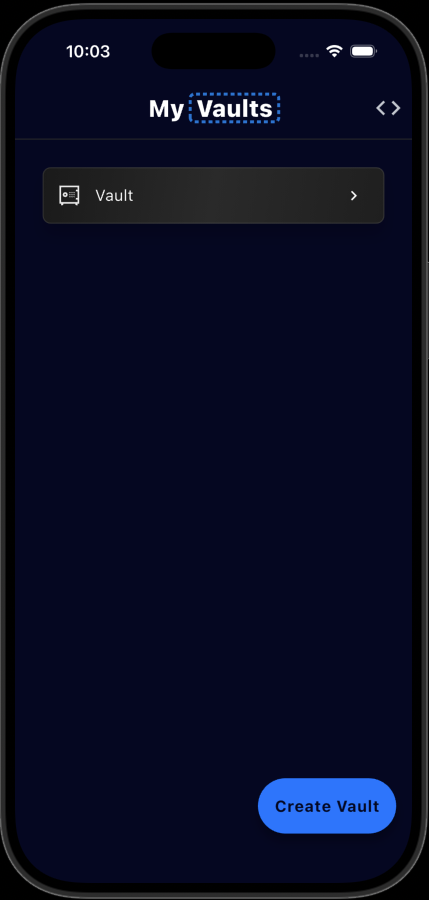</td>
<td align="center" width="33%">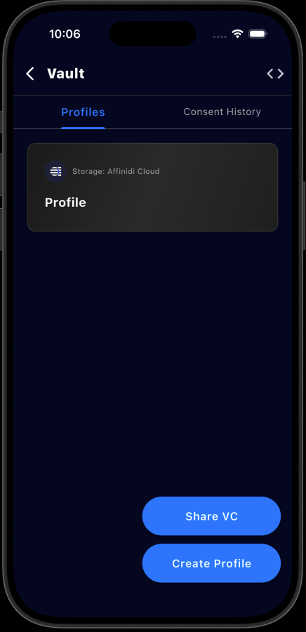</td>
<td align="center" width="33%">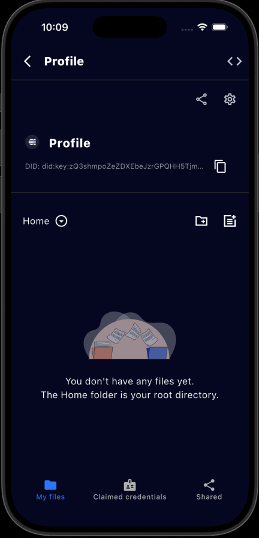</td>
</tr>
<tr>
<td align="center" width="33%"><strong>4. Tap + to claim a credential</strong></td>
<td align="center" width="33%"><strong>5. Paste the credential offer URL</strong></td>
<td align="center" width="33%"><strong>6. Review the credential details</strong></td>
</tr>
<tr>
<td align="center" width="33%">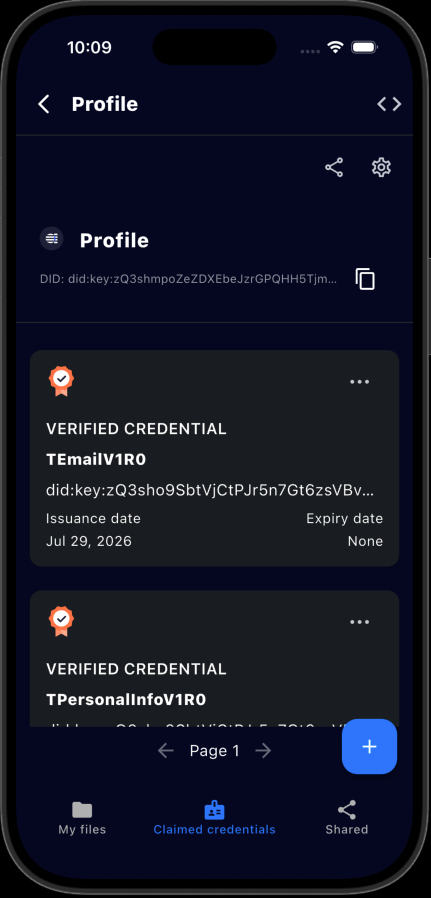</td>
<td align="center" width="33%">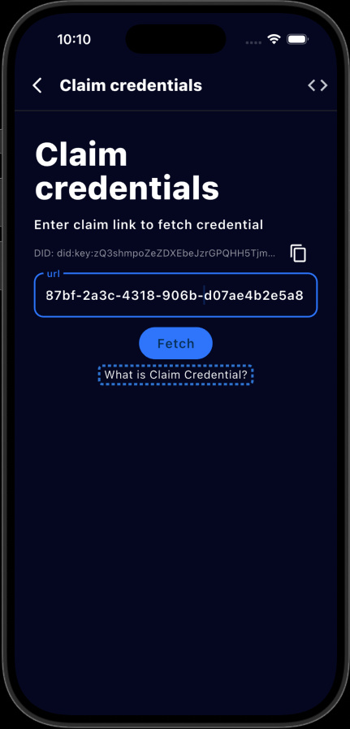</td>
<td align="center" width="33%">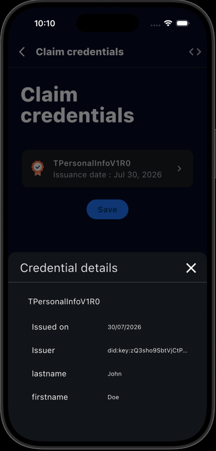</td>
</tr>
<tr>
<td align="center" width="33%"><strong>7. Save it to your vault</strong></td>
<td align="center" width="33%"><strong>8. Credential saved, ready to share</strong></td>
<td align="center" width="33%"></td>
</tr>
<tr>
<td align="center" width="33%">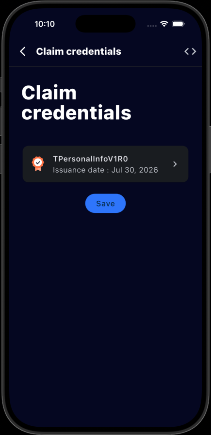</td>
<td align="center" width="33%">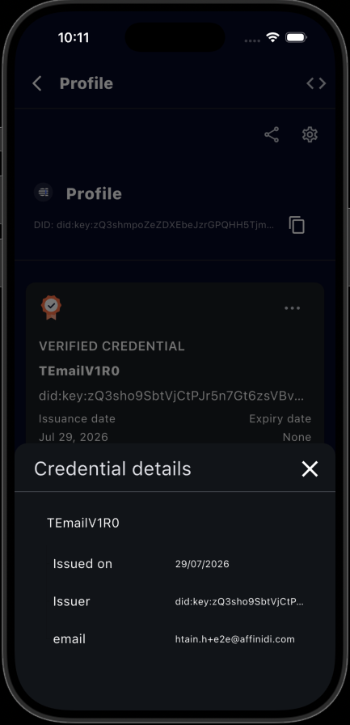</td>
<td align="center" width="33%"></td>
</tr>
</table>

<strong>Vault Backup and Restore</strong>

Export an encrypted JSON backup from the vault list and restore it on the same or another device. The backup includes wallet data, local profiles, credentials, files, and consent history. Cloud profile data is excluded from this local backup flow.

### Back up a vault

1. Open the vault list.
2. Tap the backup action on the vault card.
3. Enter the vault passphrase.
4. Save the encrypted JSON backup file.

### Restore a vault

1. Open the vault list.
2. Tap **Restore Vault**.
3. Choose the JSON backup file.
4. Enter the vault passphrase.
5. Confirm or edit the restored vault name.
6. Open the restored vault and verify its local profiles, credentials, files, and consent history.

The app rejects invalid backup files, incorrect passphrases, and backups whose wallet seed is already present on the device.

Screenshots to add later:

- Vault list with the backup action visible on a vault card.
- Backup page with the passphrase field.
- Saved backup file confirmation.
- Restore Vault page with a selected backup file.
- Successful restore confirmation.
- Vault list showing the restored vault.
- Duplicate restore error.

<strong>Sharing Credentials</strong>

Respond to a verifier's data request using the OID4VP share flow. You open a share request by pasting its URL, the app finds the matching credentials in your vault, and you choose which one(s) to share before submitting. When more than one credential matches the request, tap the credential name to choose which one to share.

<table>
<tr>
<td align="center" width="33%"><strong>1. Open your Vault</strong></td>
<td align="center" width="33%"><strong>2. Tap Share</strong></td>
<td align="center" width="33%"><strong>3. Paste the share request URL</strong></td>
</tr>
<tr>
<td align="center" width="33%"></td>
<td align="center" width="33%">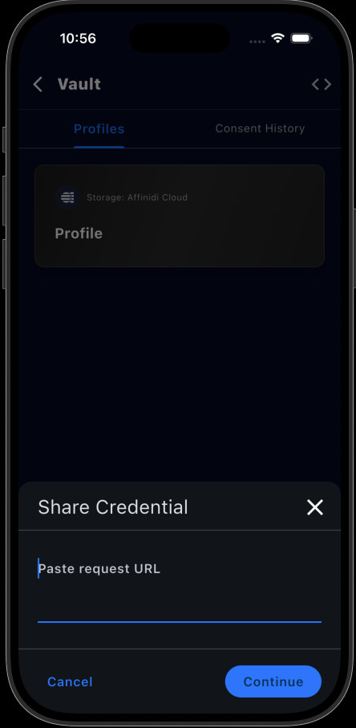</td>
<td align="center" width="33%">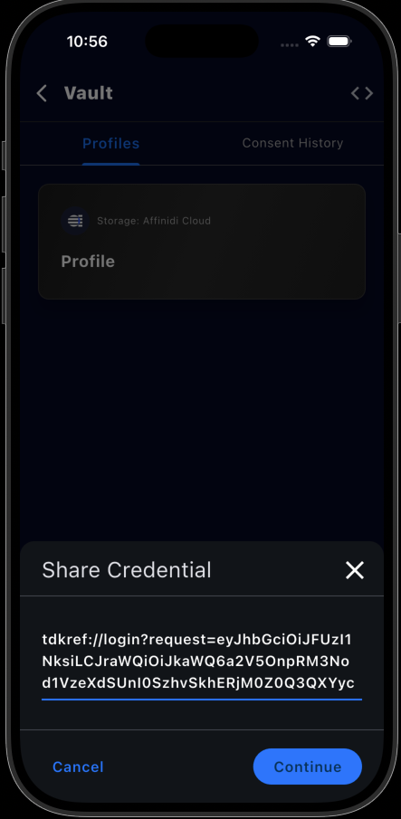</td>
</tr>
<tr>
<td align="center" width="33%"><strong>4. Review the requested data</strong></td>
<td align="center" width="33%"><strong>5. Choose which credential to share</strong></td>
<td align="center" width="33%"><strong>6. Shared successfully</strong></td>
</tr>
<tr>
<td align="center" width="33%">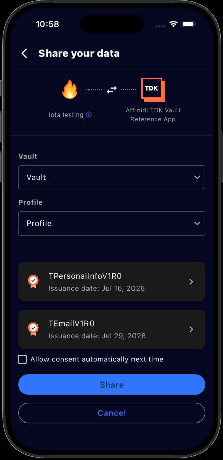</td>
<td align="center" width="33%">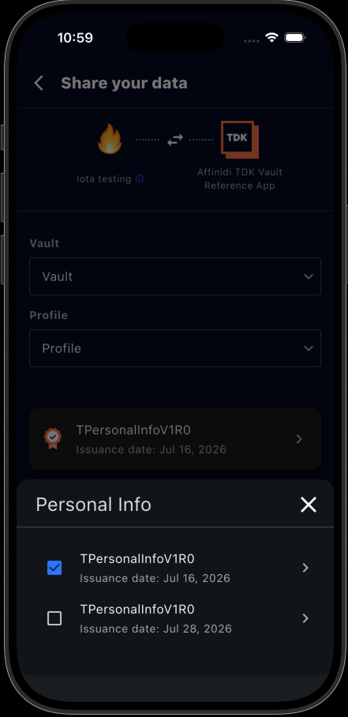</td>
<td align="center" width="33%">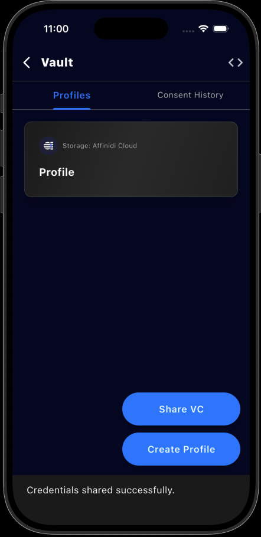</td>
</tr>
</table>

